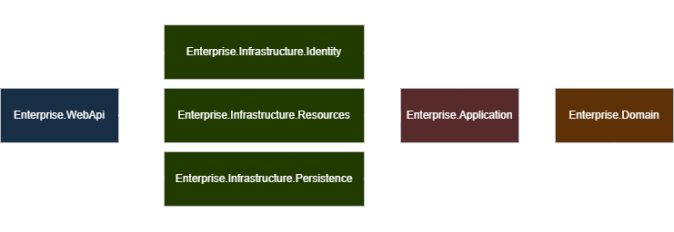

# Enterprise

The purpose of this template is to provide a robust and streamlined methodology for enterprise application development. By leveraging Clean Architecture principles and ASP.NET Core, it delivers a maintainable, scalable, and testable foundation suitable for modern enterprise-grade systems. This structure minimizes coupling, maximizes cohesion, and promotes long-term sustainability.

## Technologies

- **ASP.NET Core 10 Web API**
- **RESTful Standards**
- **Entity Framework Core (Code First)**
- **Microsoft Identity**
- **JWT Authentication**
- **Serilog**
- **Swagger / OpenAPI**

## Architecture & Design

- **Clean Architecture**
- **CQRS with Mediator Pattern**
- **Repository Pattern (Generic)**
- **Response Wrappers**
- **Pagination Support**
- **Health Checks**
- **Localization (fa / en)**

## Security & Identity

- **JWT-based Authentication**
- **Role-based Authorization**
- **Identity Seeding**
- **Complete User Management Module**
  - Register
  - Authenticate
  - Change Username
  - Change Password
- **User Auditing**

## Validation & Error Handling

- **FluentValidation**
- **Custom Exception Handling Middlewares**
- **Standardized Error Responses**

## Data Management

- **Database Seeding**
- **Identity Seeding**
- **Unit of Work Pattern**
- **Transactional Consistency**

## Testing Strategy

- **Unit Tests**
- **Integration Tests**
- **Functional Tests**

## Prerequisites

- **Visual Studio 2026 Community or higher**
- **.NET 10 SDK or higher**
- **Basic understanding of software architecture and clean code principles**

## Project Goals

- Enforce clear separation of concerns
- Improve testability and maintainability
- Provide a production-ready enterprise template
- Accelerate development with proven architectural patterns

## License

This project is licensed under the **MIT License**.
